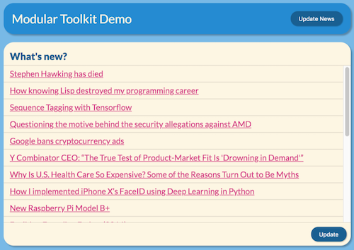

# demo-app

A small web application that demonstrates how to use the modular toolkit to integrate a demo module.

## Installation

    npm install 

## Usage

After installing, start the demo app with:

    npm start
    
Access the web app in your favorite browser with this URL: [http://localhost:8080/](http://localhost:8080/).
   
## Change Log

* See [CHANGELOG.md](CHANGELOG.md)

## Contribution Guidelines

* See [CONTRIBUTING.md](../../CONTRIBUTING.md)

## License

[MIT licensed](LICENSE)

Copyright © 2018 mobile.de GmbH
