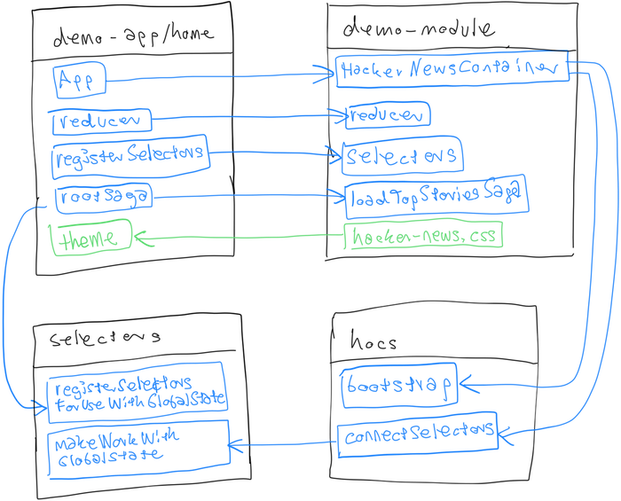

# demo-app

A small web application that demonstrates how to use the modular toolkit to integrate a demo module.

## Installation

    npm install 

## Usage

After installing, start the demo app with:

    npm start
    
Access the web app in your favorite browser with this URL: [http://localhost:3000/](http://localhost:3000/).
   
## Change Log

* See [CHANGELOG.md](CHANGELOG.md)

## Contribution Guidelines

* See [CONTRIBUTING.md](../../CONTRIBUTING.md)

## Code Ownership

This code was brought to you by **Team GT** of mobile.de's product and technology  department.

* Jakob Gehring, product owner
* [Christoph Springer](https://github.corp.ebay.com/chrispringer), team lead
* [Patrick Hund](https://github.corp.ebay.com/pahund), software engineer (frontend)
* [Nina Maaß](https://github.corp.ebay.com/jmaass), software engineer (frontend)
* [Eike Schulte-Kersmecke](https://github.corp.ebay.com/eschultekersmeck), software engineer (backend)
* [Anja Kunkel](https://github.corp.ebay.com/ankunkel), software engineer (backend)
* [Mike Krüger](https://github.corp.ebay.com/mikkrueger), quality assurance engineer

### Contact the Team

* Slack: [#mob-team-gt](https://ebayclassifiedsgroup.slack.com/messages/mob-team-gt/)

## License

[MIT licensed](LICENSE)

Copyright © 2018 mobile.de GmbH
